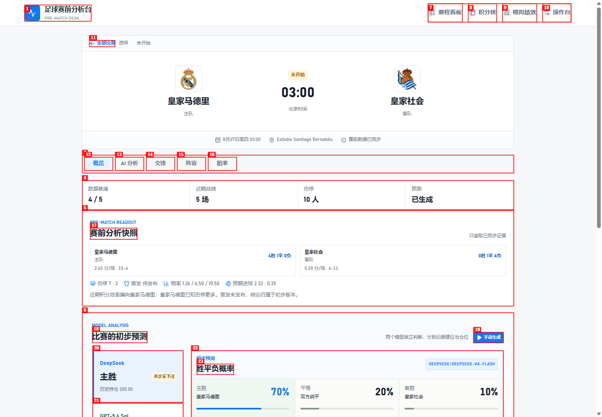
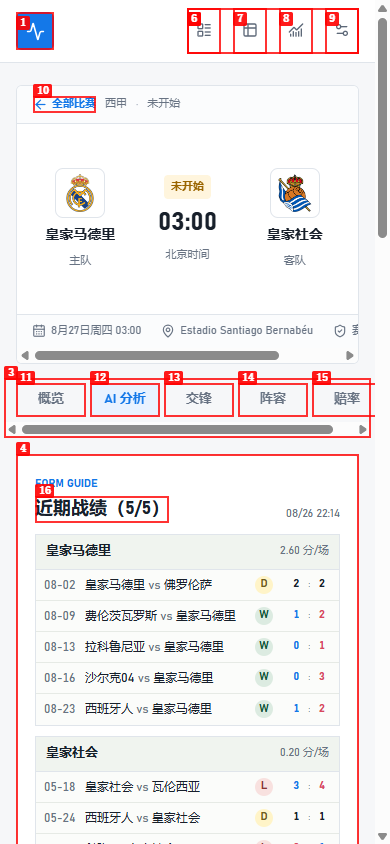
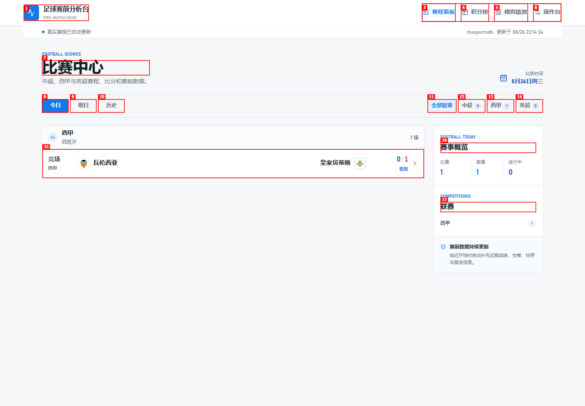

# Browser QA Report: 足球赛前分析台

| Field | Value |
|---|---|
| Date | 2026-08-26 |
| App URL | http://127.0.0.1:3000 |
| Session | football-ai-audit |
| Scope | Public desktop/mobile navigation and read-only prediction presentation |

## Summary

| Severity | Count |
|---|---:|
| Critical | 0 |
| High | 1 |
| Medium | 1 |
| Low | 1 |
| Total | 3 |

## Issues

### ISSUE-001: Operator console is publicly accessible without sign-in

| Field | Value |
|---|---|
| Severity | high |
| Category | functional / access control |
| URL | http://127.0.0.1:3000/admin |
| Repro Video | N/A |

**Description**

Opening the operator URL in a fresh unauthenticated browser displays controls for fixture synchronization and immediate fixture, standings, evidence/prediction, and settlement jobs. The public match page also displays a “手动生成” model action. A production visitor should not be able to reach privileged operational controls. Neither page showed a sign-in or authorization boundary.

**Repro Steps**

1. Navigate directly to `http://127.0.0.1:3000/admin` without signing in.
2. Observe the visible operator controls, including “同步赛程” and four “立即运行” buttons.

The same privileged model action is visible on the public match page:

### ISSUE-002: Mobile match page exposes clipped horizontal scroll regions

| Field | Value |
|---|---|
| Severity | medium |
| Category | visual / UX |
| URL | http://127.0.0.1:3000/matches/sportsdb-2506175 |
| Repro Video | N/A |

**Description**

At a 390x844 mobile viewport, the match metadata and five-tab navigation render as separate horizontally scrollable strips with visible browser scrollbars. Stadium/status text is clipped and additional content is only discoverable by horizontal scrolling. The document itself does not overflow, but the two nested scroll regions make the core mobile workflow feel unfinished.

**Repro Steps**

1. Open the match URL at a 390x844 viewport.
2. Observe clipped match metadata and the visible horizontal scrollbars below metadata and tabs.

### ISSUE-003: English micro-labels reduce Chinese product cohesion

| Field | Value |
|---|---|
| Severity | low |
| Category | content / visual |
| URL | http://127.0.0.1:3000 |
| Repro Video | N/A |

**Description**

The interface mixes English labels such as `FOOTBALL SCORES`, `FOOTBALL TODAY`, `COMPETITIONS`, `FORM GUIDE`, and `MODEL PERFORMANCE` into otherwise Chinese navigation and content. These labels add visual noise without helping comprehension and make the product identity feel less deliberate.

**Repro Steps**

1. Open the home or match page.
2. Observe English uppercase micro-labels above Chinese section titles.

