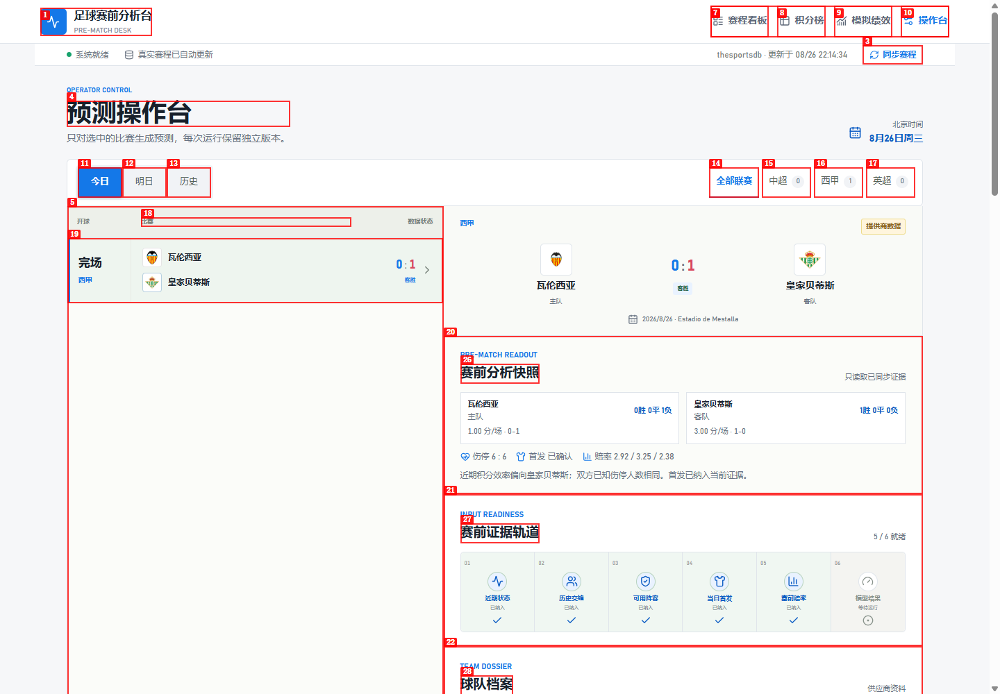

# Browser QA Report: 足球赛前分析台

| Field | Value |
|---|---|
| Date | 2026-08-26 |
| App URL | http://127.0.0.1:3000 |
| Session | football-ai-audit |
| Scope | Public desktop/mobile navigation and read-only prediction presentation |

## Summary

| Severity | Count |
|---|---:|
| Critical | 0 |
| High | 1 |
| Medium | 0 |
| Low | 0 |
| Total | 1 |

## Issues

### ISSUE-001: Operator console is publicly accessible without sign-in

| Field | Value |
|---|---|
| Severity | high |
| Category | functional / access control |
| URL | http://127.0.0.1:3000/admin |
| Repro Video | N/A |

**Description**

Opening the operator URL in a fresh unauthenticated browser displays controls for fixture synchronization and immediate fixture, standings, evidence/prediction, and settlement jobs. A production visitor should not be able to reach privileged operational controls. The page showed no sign-in or authorization boundary.

**Repro Steps**

1. Navigate directly to `http://127.0.0.1:3000/admin` without signing in.
2. Observe the visible operator controls, including “同步赛程” and four “立即运行” buttons.

